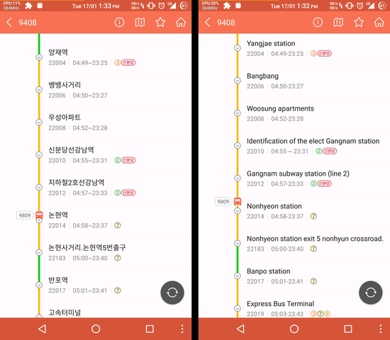
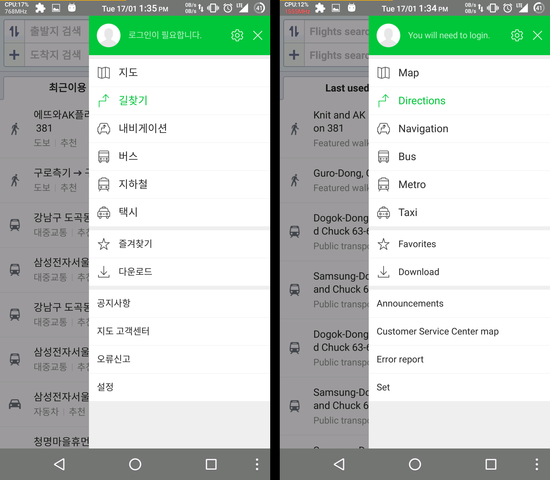
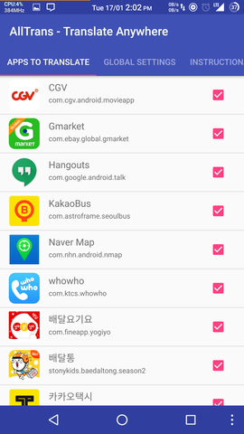
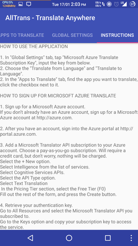

# AllTrans - Completely Translate Apps
à la Chrome translation of webpages, but for Android apps

## What AllTrans does
It replaces **all text in an app** in a language from one language to another at runtime.
Say for example an app is in German. A user selects the app name, and the required language conversion (say German to English).
Then whenever the user uses the required app, all the text, **ANYWHERE** in the app, are replaced by their English equivalents.
This is something similar to the way Google Translate works in Chrome.

##ScreenShots
Below are some screenshots of AllTrans translating apps from Korean to English

Below are some of the screenshots of AllTrans app

## How to install AllTrans
1. This application requires android version 5.0 or later (Android Lollipop or later - so far MarshMallow and Nougat).
2. Make sure your android phone is [rooted](https://en.wikipedia.org/wiki/Rooting_(Android_OS)). If you don't know what rooting is, this app won't work for you.
3. Make sure you have [Xposed Framework](https://forum.xda-developers.com/showthread.php?t=3034811) installed and running.
4. Build this project and install the produced AllTrans apk.

## How to use AllTrans
1. Launch AllTrans app. In "Global Settings" tab, tap "Microsoft Azure Translate Subscription Key", input the key from below.
2. Choose the "Translate from Language" and "Translate to Language".
3. In the "Apps to Translate" tab, find the app you want to translate, click the checkbox next to it.

## How to sign up for Microsoft Azure Translate
1. Sign up for a Microsoft Azure account.
If you don’t already have an Azure account, sign up for a Microsoft Azure account at http://azure.com.
2. After you have an account, sign into the Azure portal at http://portal.azure.com.
3. Add a Microsoft Translator API subscription to your Azure account. Choose a pay-as-you-go subscription. Will require a credit card, but don't worry, nothing will be charged.
Select the + New option.
Select Intelligence from the list of services.
Select Cognitive Services APIs.
Select the API Type option.
Select Text Translation
In the Pricing Tier section, select the Free Tier (F0)
Fill out the rest of the form, and press the Create button.
4. Retrieve your authentication key.
Go to All Resources and select the Microsoft Translator API you subscribed to.
Go to the Keys option and copy your subscription key to access the service.

## TroubleShooting
1. If the app get stuck on loading the first time after you start translating, open AllTrans, click on the app in "Apps to translate" tab, and in "Other Settings" fill in "Delay Before Translating" to 2000.
2. If the app used to translate fine, but stopped loading, open AllTrans, click on the app in "Apps to translate" tab, and click on "Click to Clear Translation Cache".
3. If the app is not being translated, open AllTrans, click on the app in "Apps to translate" tab, and enable "Aggressive Mode". Also check your Microsoft Subscription Key is correct.

## License
This program is AllTrans
Copyright (C) 2017  Akhil Kedia

This program is free software: you can redistribute it and/or modify it under the terms of the GNU General Public License as published by the Free Software Foundation, either version 3 of the License, or (at your option) any later version.

This program is distributed in the hope that it will be useful, but WITHOUT ANY WARRANTY; without even the implied warranty of MERCHANTABILITY or FITNESS FOR A PARTICULAR PURPOSE. See the GNU General Public License for more details.

You should have received a copy of the GNU General Public License along with this program. If not, see <http://www.gnu.org/licenses/>.
